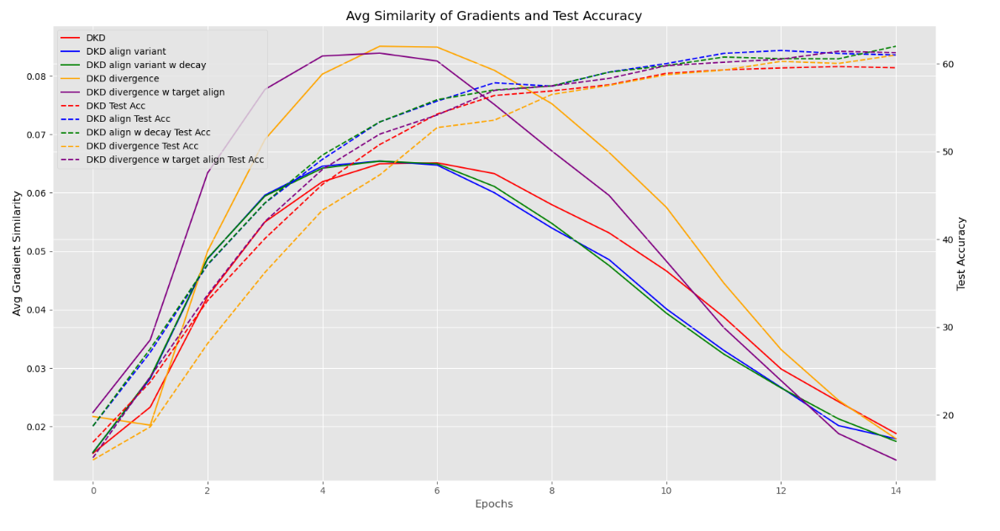

# Decoupled-Gradient-Knowledge-Distillation

This repository implements *Decoupled Gradient Knowledge Distillation*: an extension of the existing Knowledge Distillation technique known as "Decoupled Knowledge Distillation." [Paper Link](https://arxiv.org/abs/2203.08679) <br> 
In this implementation, we introduce the gradients of the Target Class Logits and Non-Target class logits in the loss function and maximize their mean-squared error loss. The loss function is given as follows. 

```math 
Loss_{DKD} = \alpha * TCKD + \beta * NCKD - \epsilon * \text{MSE(Target class gradients, Non target class gradients)}  
```

While it is non-trivial to maximize mean-squared-error loss, the experimentations led to better performance on maximizing this term. This was because maximizing the mean-squared error loss led to the student's target-class logits matching closely with the teacher's target class logits, therefore matching the **fidelity** of the system. <br> 

We noticed the following observations by maximizing the mean-squared error term in the loss function:
- The loss remains nearly identical whether the student's target class logit is confident enough to make a correct prediction or highly confident. For instance, consider **Scenario A**, where the student's target class probability is **0.6** and the teacher's is **0.8**, and **Scenario B**, where these probabilities are reversed. In both cases, the loss value remains the same. This indicates that the loss encourages confidence in the target class **only up to the threshold needed for a correct prediction**, preventing excessive overfitting.  

- When the student makes a correct prediction but the teacher does not, the **mean-squared error (MSE) loss** is higher. This suggests that the loss function prioritizes aligning the student's logits with the teacher’s, emphasizing fidelity over correctness alone.  

- The student's **intra-class feature representations** trained with this loss function are more compact compared to prior methods in the literature. This leads to a **faster neural collapse**, improving overall model efficiency and generalization.

## Convergence Rates

<br>

The overall effect is seen as an increase in convergence rates in Decoupled Gradient Knowledge Distillation (**DKD Align**) orange curve. <br>

## Comparison Table
The table below represents our results *so-far* on the experiments conducted. The *dataset* column is formatted as follows: `<Dataset>-<Teacher Model>-<Student Model>`. 

| Dataset                                 | Gradient Decoupled KD | Decoupled KD |
|-----------------------------------------|--------------------|------------------------|
| CIFAR-100 - Resnet50-resnet18           | **62.01%**             | 61.07%                 |
| CIFAR100 - VIT-S-resnet18               | **58.64%**             | 57.31%                 |
| CIFAR100 - Self Distillation Resnet18   | **62.35%**             | 61.53%                 |
| CIFAR100 - Self Distillation Resnet50   | 53.39%             | **54.31%**                 |
| CIFAR100 - Self Distillation Resnet101  | **55.94%**             | 48.99%                 |
| CIFAR-100 ShuffleNetv2 - Resnet50       | 55.49%             | **56.48%**                 |
| CIFAR-100 ShuffleNetv2 - VIT-S          | 55.56%             | **55.84%**                 |
| Imagenet resnet50-18                    | **48.42%**             | 45.48%                 |
| Imagenet resnet50-shufflenet            | 44.90%             | **45.59%**                 |
| Imagenet vit-s-resnet18                 | **41.81%**             | 41.57%                 |
| Imagenet vit-s-shufflenet              | **39.74%**             | 39.42%                 |
| Imagenet self distillation resnet101    | **30.49%**             | 0.50%                  |
| Imagenet self distillation resnet50     | **48.09%**             | 48.06%                 |
| Imagenet self distillation resnet18     | **48.29%**             | 46.40%                 |

*Ourperforming experiments are bolded* <br>

From the table above, we infered that our variant was not successful in ourperforming Decoupled KD in mobile networks or smaller CNN models such as ShuffleNetV2 and MobileNet, however it was still consistent across 10/14 experiments. 

# Future Work
We discontinued the project due to some technical concerns in deriving the loss function through BPTT (Backpropogation through time) which resulted in inconsistent understanding of the model's performance and the loss function itself. Therefore, for the future work I intend to continue to 

- Disect the loss function and complete its derivation to further develop the understanding of the model's architectural differences (benefits and disadvantages). In doing so, it is highly important to understand the role of Non Target Class and Target Class Logits in this space.
- Continue the experimentation across more complex datasets in image classification: Animal10, and OOD Generalization (Scrambled, Noisy)
- Continue the experimentations across object detection datasets: MS COCO

