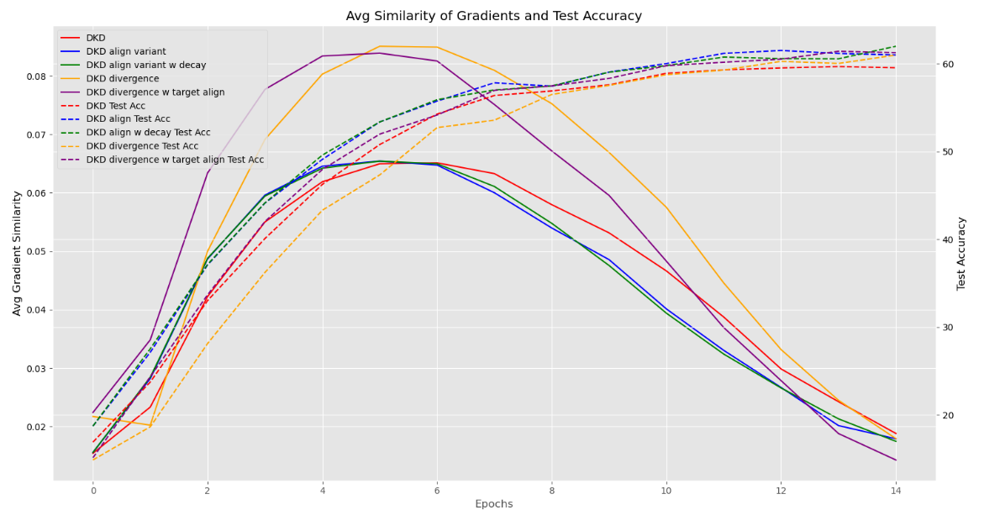

# Decoupled Gradient Knowledge Distillation

This repository implements **Decoupled Gradient Knowledge Distillation (DGKD)**: an extension of [Decoupled Knowledge Distillation (DKD)](https://arxiv.org/abs/2203.08679) that introduces a gradient-alignment term into the loss function.

## Method

Standard DKD decomposes the KD loss into two independent terms — Target Class KD (TCKD) and Non-Target Class KD (NCKD) — enabling separate control over each. DGKD augments this with a gradient decoupling term that maximizes the mean-squared error between the gradients of TCKD and NCKD with respect to the student logits:

```math
\mathcal{L}_{\text{DGKD}} = \alpha \cdot \mathcal{L}_{\text{TCKD}} + \beta \cdot \mathcal{L}_{\text{NCKD}} - \varepsilon \cdot \text{MSE}\!\left(\nabla_{\text{target}},\, \nabla_{\text{non-target}}\right)
```

where $\nabla_{\text{target}}$ and $\nabla_{\text{non-target}}$ are the partial derivatives of TCKD and NCKD w.r.t. the student logits, computed via `torch.autograd.grad`.

**Intuition behind maximizing the gradient MSE:**  
Pushing the two gradient signals apart encourages the student's target-class logits to track the teacher's closely (fidelity), while allowing the non-target distribution to evolve independently. This produces three observable effects:

- **Calibrated confidence** — the loss is symmetric around the teacher's target-class probability, so the student is discouraged from over-fitting beyond what is needed for a correct prediction.
- **Fidelity over correctness** — when the student is right but the teacher is wrong, the MSE penalty is *higher*, keeping logit alignment with the teacher as the primary objective.
- **Faster neural collapse** — intra-class feature representations are more compact compared to prior methods, leading to earlier and tighter neural collapse during training.

The training loop also tracks the following diagnostic quantities per epoch: gradient cosine similarity, gradient L2 norms (target/non-target), logit norms, and the normalized cross-covariance between the two gradient fields.

## Repository Structure

```
.
├── distillation/
│   ├── dkd.py            # DKD/DGKD forward pass and loss orchestration
│   ├── logitmatching.py  # Baseline logit-matching distillation
│   ├── main.py           # KnowledgeDistillation training loop + CSV logging
│   ├── models.py         # Teacher/Student model wrappers + MODEL_REGISTRY
│   └── utils.py          # dkd_loss(): TCKD, NCKD, gradient computations
├── models/
│   ├── resnet.py         # ResNet variants (resnet8–110, resnet8x4, resnet32x4)
│   ├── vgg.py            # VGG variants (vgg8–19, with/without BN)
│   └── ShuffleNetv2.py   # ShuffleNetV2
├── dataset/
│   ├── cifar.py          # CIFAR-10 / CIFAR-100
│   ├── mnist.py          # MNIST
│   ├── svhn.py           # SVHN
│   ├── food101.py        # Food-101
│   ├── tiny_imagenet.py  # Tiny ImageNet
│   ├── custom.py         # ImageFolder-format custom datasets
│   └── augmentations.py  # Shared augmentation pipelines
├── scripts/
│   ├── train.py          # Main entry point
│   └── finetune.py       # Standalone finetuning + LR scheduler
├── utils.py              # Argument parser, seed setting, param counting
└── logs-results/         # Per-run CSV logs (auto-created)
└── checkpoints/          # Saved model weights (auto-created)
```

## Installation

```bash
conda create -n dgkd python=3.10
conda activate dgkd
pip install torch torchvision tqdm
```

## Usage

Run distillation from `scripts/train.py`. The script handles teacher training (or loading from checkpoint), optional student baseline training, and knowledge distillation in one pass.

```bash
python -m scripts.train \
  --teacher_arch resnet50 \
  --student_arch resnet18 \
  --dataset CIFAR-100 \
  --epochs 240 \
  --batch_size 64 \
  --learning_rate 0.05 \
  --temperature 4.0 \
  --warmup 20 \
  --loss_weights 1.0 1.0 6.0 \
  --distillation_method decoupled_gradient_distillation \
  --teacher_checkpoint checkpoints/CIFAR-100/resnet50_CIFAR-100.pth \
  --distillation_save_path checkpoints/CIFAR-100/dgkd_resnet18_resnet50.pth
```

### Key Arguments

| Argument | Default | Description |
|---|---|---|
| `--teacher_arch` | `resnet18` | Teacher architecture (see supported models below) |
| `--student_arch` | `resnet18` | Student architecture |
| `--dataset` | `CIFAR-10` | `MNIST`, `CIFAR-10`, `CIFAR-100`, `SVHN`, `Food101`, `TinyImageNet` |
| `--distillation_method` | `None` | `logit_matching` \| `decoupled` \| `decoupled_gradient_distillation` |
| `--loss_weights` | `1.0 1.0 6.0` | `[α, β, ε]` — weights for TCKD, NCKD, gradient MSE |
| `--temperature` | `4.0` | Softmax temperature for distillation |
| `--warmup` | `20` | Epochs to linearly ramp up the KD loss |
| `--robustness_eval` | `None` | `stylized` \| `noised` \| `scrambled` — evaluate under distribution shift |
| `--teacher_checkpoint` | `None` | Skip teacher training and load from `.pth` |
| `--student_checkpoint` | `None` | Skip student baseline training |

### Supported Model Architectures

**ResNets:** `resnet8`, `resnet14`, `resnet20`, `resnet32`, `resnet44`, `resnet56`, `resnet110`, `resnet8x4`, `resnet32x4`  
**VGGs:** `vgg8`, `vgg8_bn`, `vgg11`, `vgg11_bn`, `vgg13`, `vgg13_bn`, `vgg16`, `vgg16_bn`, `vgg19`, `vgg19_bn`  
**Other:** `ShuffleV2`

### Distillation Methods

| Method | Description |
|---|---|
| `logit_matching` | Vanilla logit-level KD (MSE between student and teacher logits) |
| `decoupled` | DKD (TCKD + NCKD, no gradient term) |
| `decoupled_gradient_distillation` | **DGKD** — DKD + gradient MSE penalty |

## Outputs

Training logs are written to `logs-results/<dataset>/<method>_<student>_<teacher>_<dataset>.csv` with the following columns for DGKD runs:

```
epochs, train_loss, train_acc, test_acc,
avg_grad_similarity, target_norm, nontarget_norm,
target_gradmag, nontarget_gradmag, covariance
```

Model checkpoints are saved to `checkpoints/<dataset>/`.

## Results

### Convergence Rate



DGKD (**DKD Align**, orange) reaches higher accuracy earlier in training compared to standard DKD.

### Accuracy Comparison

`Dataset` column is formatted as `<Dataset>-<Teacher>-<Student>`. Bold = best result.

| Dataset | DGKD (ours) | DKD |
|---|---|---|
| CIFAR-100 — ResNet50 → ResNet18 | **62.01%** | 61.07% |
| CIFAR-100 — ViT-S → ResNet18 | **58.64%** | 57.31% |
| CIFAR-100 — Self-distill ResNet18 | **62.35%** | 61.53% |
| CIFAR-100 — Self-distill ResNet50 | 53.39% | **54.31%** |
| CIFAR-100 — Self-distill ResNet101 | **55.94%** | 48.99% |
| CIFAR-100 — ResNet50 → ShuffleNetV2 | 55.49% | **56.48%** |
| CIFAR-100 — ViT-S → ShuffleNetV2 | 55.56% | **55.84%** |
| ImageNet — ResNet50 → ResNet18 | **48.42%** | 45.48% |
| ImageNet — ResNet50 → ShuffleNet | 44.90% | **45.59%** |
| ImageNet — ViT-S → ResNet18 | **41.81%** | 41.57% |
| ImageNet — ViT-S → ShuffleNet | **39.74%** | 39.42% |
| ImageNet — Self-distill ResNet101 | **30.49%** | 0.50% |
| ImageNet — Self-distill ResNet50 | **48.09%** | 48.06% |
| ImageNet — Self-distill ResNet18 | **48.29%** | 46.40% |

DGKD outperforms DKD in **10/14** settings. The two cases where it underperforms are mobile/small CNN architectures (ShuffleNetV2), suggesting the gradient decoupling term is less effective when the student has very limited capacity.

## Limitations and Future Work

The project was paused due to challenges in deriving the gradient loss analytically through BPTT (backpropagation through time), which made it difficult to build a rigorous theoretical understanding of what the loss is optimizing. Planned future directions:

- **Formal derivation** — complete the analytical derivation of the gradient MSE term to precisely characterize the geometric relationship between TCKD and NCKD gradients it enforces.
- **Role of TCKD vs NCKD** — systematically ablate the contribution of each component, particularly understanding when NCKD gradients help or hurt in low-capacity students.
- **Broader benchmarks** — extend evaluation to Animal-10, OOD generalization settings (noisy/scrambled inputs), and object detection on MS COCO.
